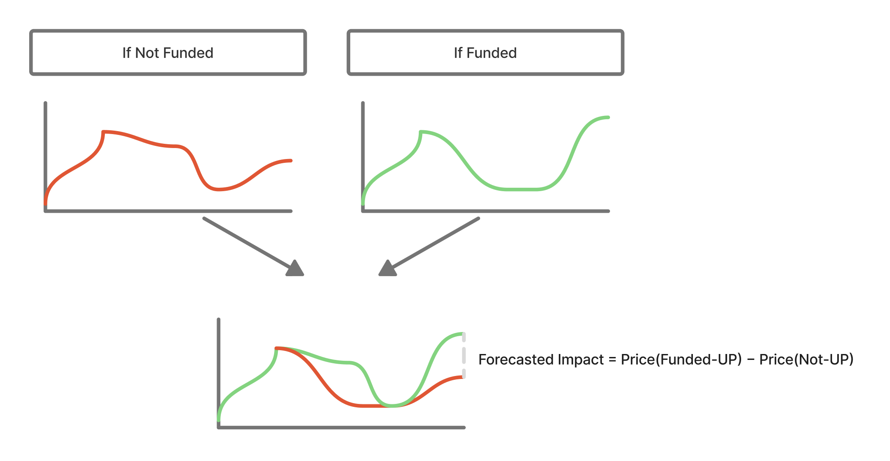
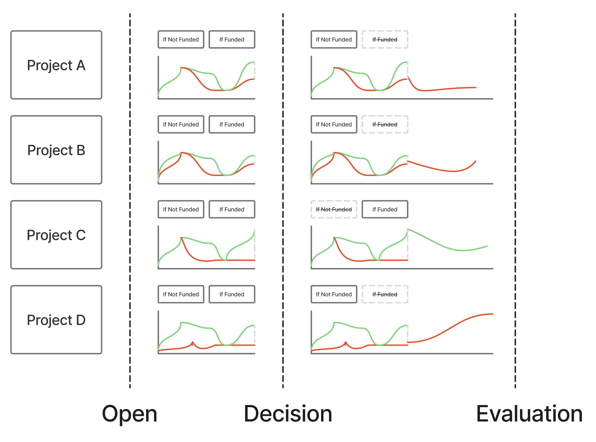
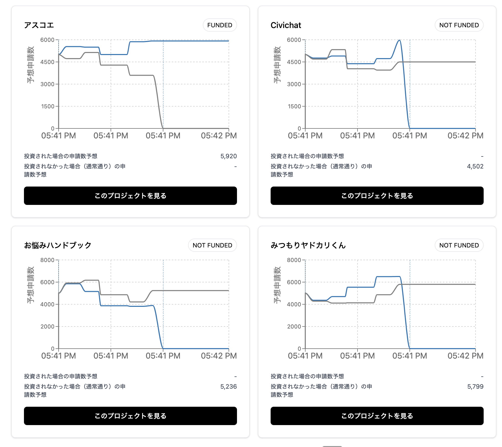

CFM（条件付き市場）プロトタイプ

概要
- フロントエンドを `frontend/` に集約した、Vite + React + TypeScript + Tailwind 構成。
- 条件付き市場（CFM）を学ぶためのシミュレーション UI。LMSR による価格・原価（`lmsrCost`/`priceUp`/`tradeCost`）を実装。
- マーケットはデモ用の `default` を同梱。ホームのカードから遷移可能。

クイックスタート
1. `cd frontend`
2. `npm install`
3. `npm run dev`
4. ブラウザで `http://127.0.0.1:5173/` を開く

主な画面と動線
- ホーム（マーケット一覧）: カードをクリックで詳細へ（`#market/default`）。
- マーケット詳細: 左にチャート群、右に取引パネル。UP/DOWN の購入、損益プレビュー、現在の市場予想（絶対値）を表示。
- ポートフォリオ: ヘッダーの「残高」をクリックで `#portfolio`。保有ポジション（Funded/Not funded × UP/DOWN）を一覧表示。
- 使い方（ヘルプ）: ヘッダー右の「使い方」→ `/howto.md` を読み込み、Markdown をモーダルで表示（段落/改行/箇条書き/リンク/画像対応）。

ビルド
- `cd frontend && npm run build` → 出力は `frontend/dist/`

スクリプト
- `npm run dev`: 開発サーバー
- `npm run build`: 本番ビルド
- `npm run preview`: ビルド結果のローカル確認

ディレクトリ構成（抜粋）
- `frontend/src/App.tsx` … エントリ。ルーティング（`#market/:id`, `#portfolio`）とヘッダー/ヘルプモーダル。
- `frontend/src/pages/Home.tsx` … マーケット一覧カード。
- `frontend/src/pages/MarketPage.tsx` … 市場ページ本体（LMSR、取引、チャート）。
- `frontend/src/pages/Portfolio.tsx` … ポートフォリオ（保有一覧）。
 - `frontend/src/components/UserPositionsAllCard.tsx` … 保有一覧カード（全プロジェクト）。
  - `frontend/src/lib/markets.ts` … 市場メタ（`name/title/overview`）。
  - `frontend/public/howto.md` … 使い方ドキュメント（Markdown）。画像は `frontend/public/` 配下に配置し `` で参照。

仕様ハイライト
- 価格モデル: LMSR。金額入力から二分探索でシェア量を算出し、正確なコストで購入。
- 予測表示: 市場予想を「市場予想: 1億円を投資された場合 / 市場予想: 投資されなかった場合」で表示（絶対値換算）。
- 管理者（Admin）: 助成確定・解決/清算のデモ機能付き。

開発メモ
- Node v16 でも動作するよう、Vite 4 / React 18 を採用。Markdown レンダリングは `marked` を使用（v9 系）。
- 使い方モーダルは `##` 見出しごとにページ分割し、リンクは新規タブで開くよう付与。画像はレスポンシブ・遅延ロード。

使い方（抜粋）
- 完全版は `frontend/public/howto.md` を参照。アプリ内のヘッダー「使い方」からも表示できます。

### このプロジェクトについて
本プロジェクトは「条件付き市場（Conditional Funding Market: CFM）」の考え方を学ぶための、シミュレーションツールです。

CFM は、「あるプロジェクトに資金を投資した場合」と「投資しなかった場合」という 条件付きの未来 を比較し、その結果の差（インパクト）を予測するための予測市場モデルです。

- 開発者: tkgshn（[@0xtkgshn](https://twitter.com/0xtkgshn)）
- ソースコード: [https://github.com/tkgshn/cfm](https://github.com/tkgshn/cfm)

### 条件付き市場と予測インパクト

各プロジェクトには 2 つの条件付き市場（If Funded / If Not Funded）が存在し、それぞれで予測された結果の差分が「予測インパクト」です。

### スカラー市場について
CFM が使うのはスカラー市場（Scalar Market）。レンジ [min, max] を 0〜1 に正規化し、清算時は UP = v, DOWN = 1−v で支払われます。取引時の価格は LMSR による 0〜1 の値で、UI 上ではレンジに換算して「予測件数」として表示します。

### 市場開始から政策決定、精算まで

1. 市場開始: If Funded / If Not Funded を両方開設
2. 政策決定: 予測インパクト最大のプロジェクトを選定（他は不要市場を Void）
3. 精算: 実測値を確定し、残った市場を清算

### 今回の市場

「それぞれの社会保障制度の診断プロジェクトに 1 億円を投資した場合の申請数予測」をテーマに、4 プロジェクトを対象にしています。

ライセンス
- 本リポジトリ全体のライセンスは未定義です。別途指定がある場合を除き、社内検証用途を想定しています。
